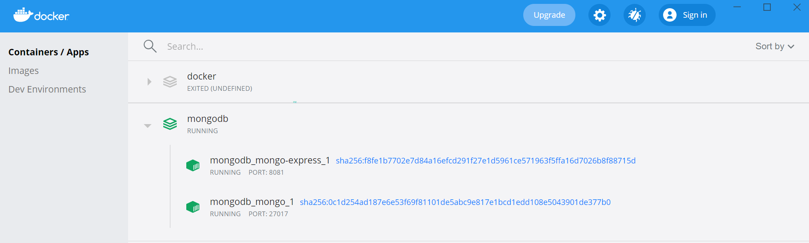
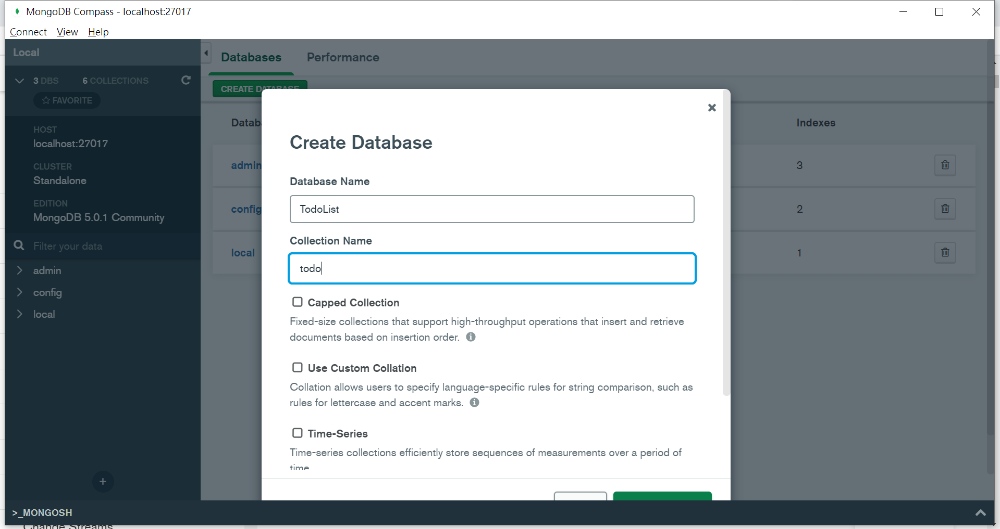
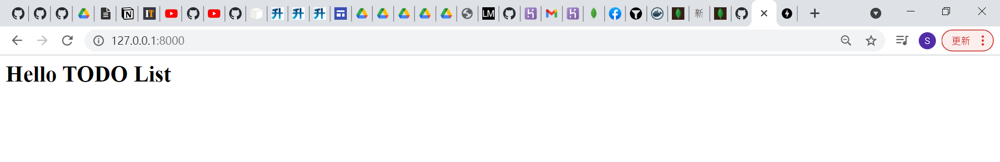
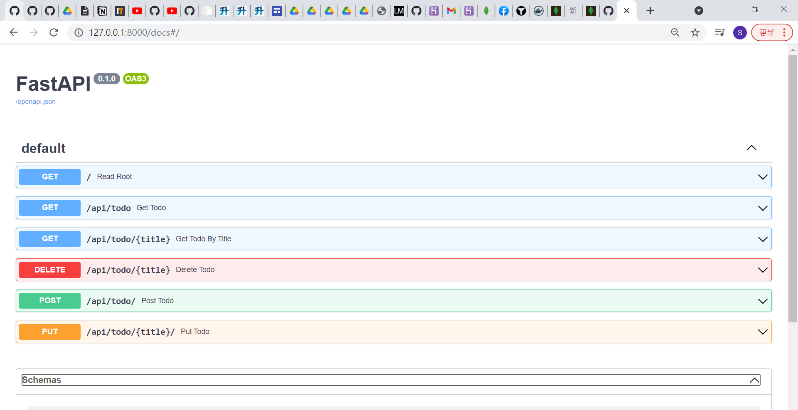
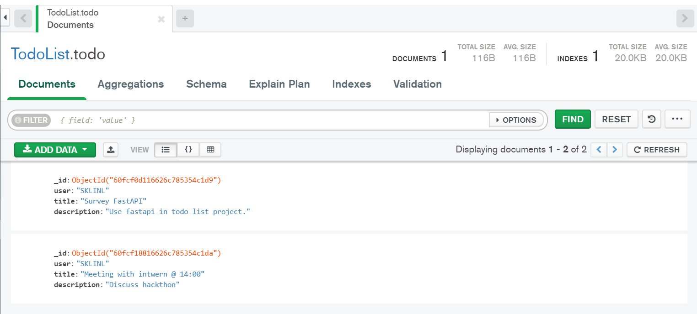

# ToDoList_FARM-stack

## MongoDB
Start local mongodb
```docker
cd mongodb
docker compose up -d
```

create Databases & todo collection



## FastAPI
```python
pip install -r requirements.txt
```

Start main.py
```python
uvicorn main:app --reload
```
After start it:


### FastAPI
Auto gen API documents


Post Result
