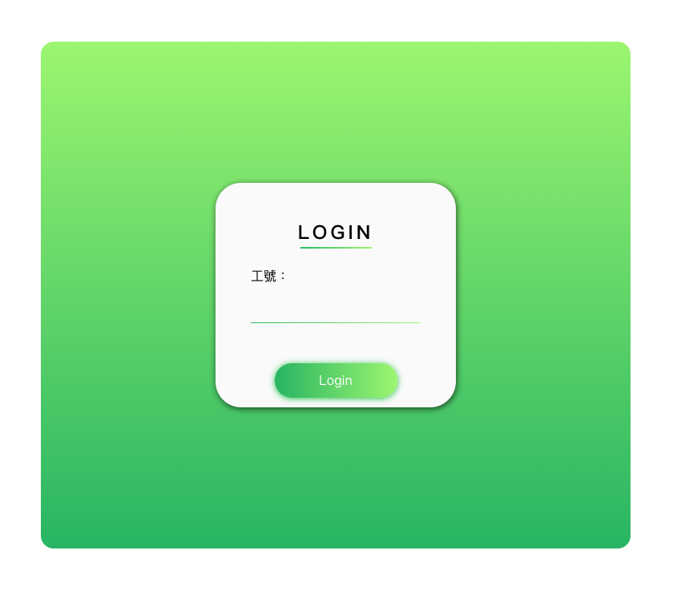
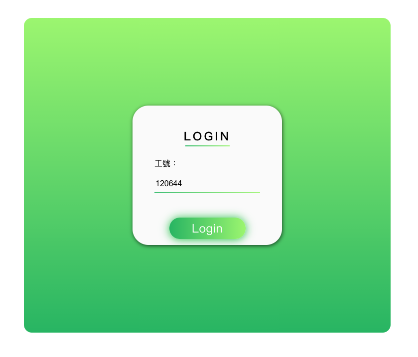
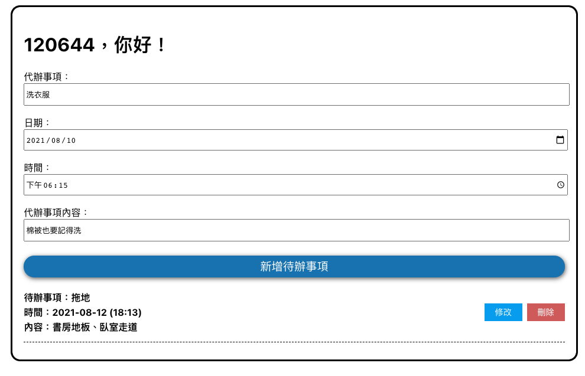
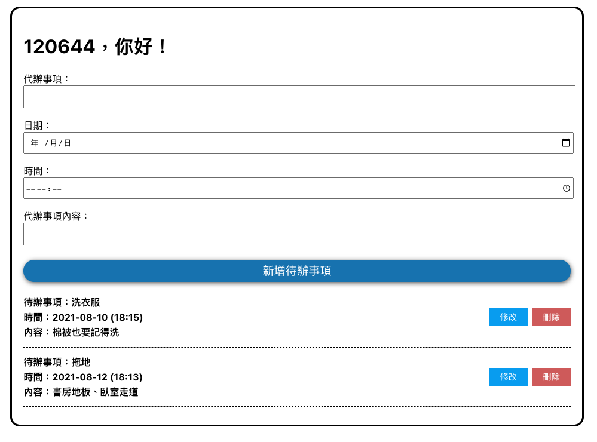
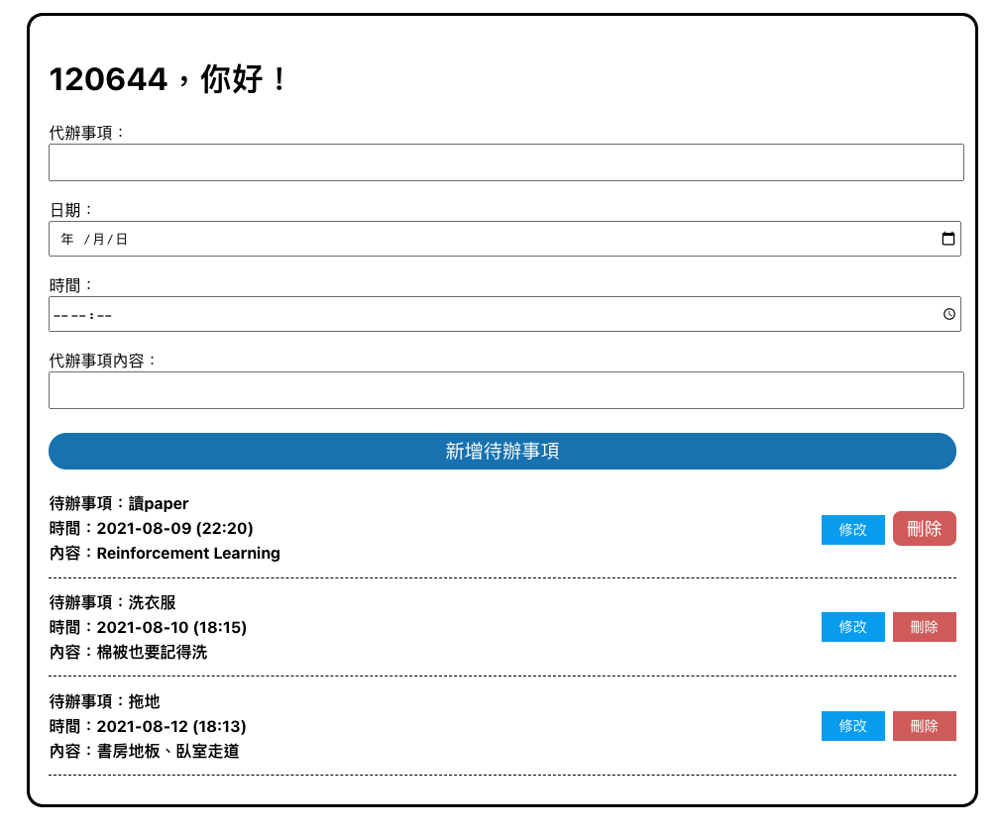
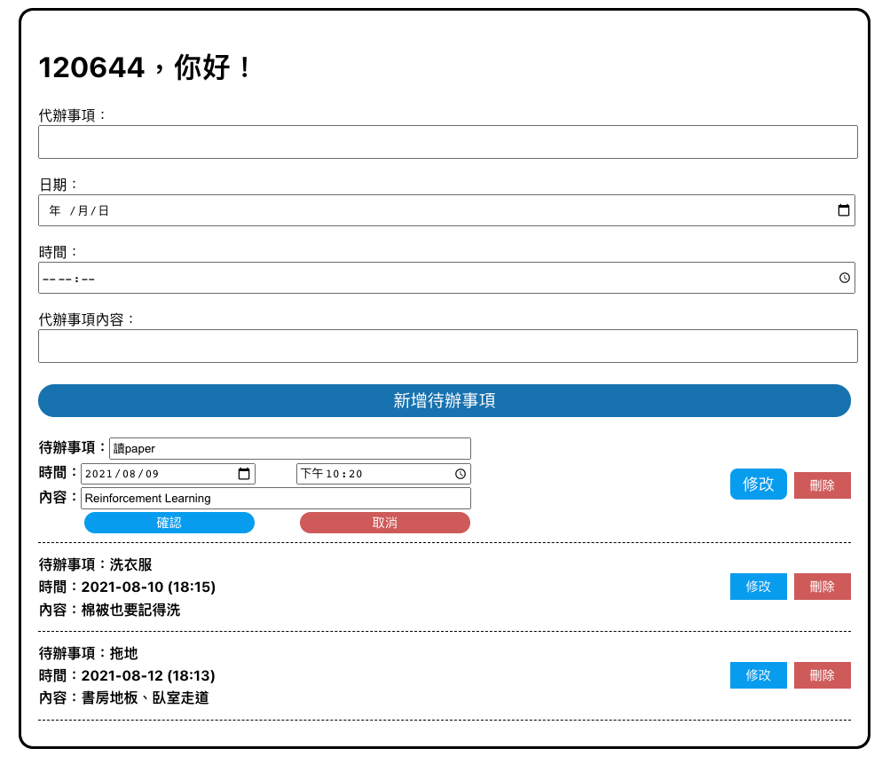

### The web is deployed on GCP
```
https://tsmc-todolist.de.r.appspot.com/
```

### 登入頁面


### 在Teams註冊過後 輸入工號點擊「Login」即可登入


### 輸入待辦事項、時間、日期、內容後 點擊「新增代辦事項」即可新增



### 點擊任何一個待辦事項的「刪除」鍵即可刪除


### 點擊任何一個待辦事項的「修改」鍵即可修改
#### 修改後點擊「確認」儲存修改內容、點擊「取消」放棄修改內容

