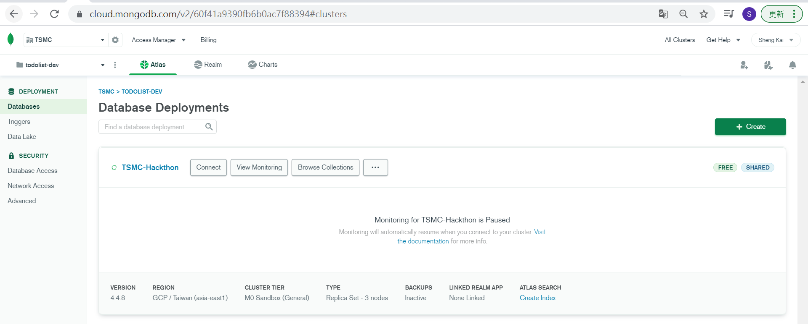
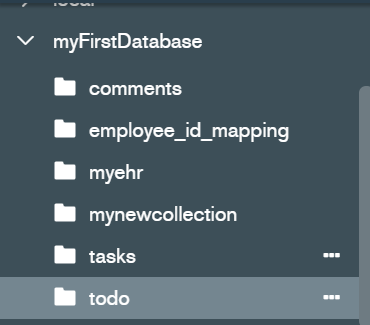

# Start
```yaml
docker compose up -d
```
# MongoDB develop from local
use docker to build local mongo


# In Google cloud
with Replica Set - 3 nodes


# MongoDB create


# MongoDB collection


# MongoDB content

